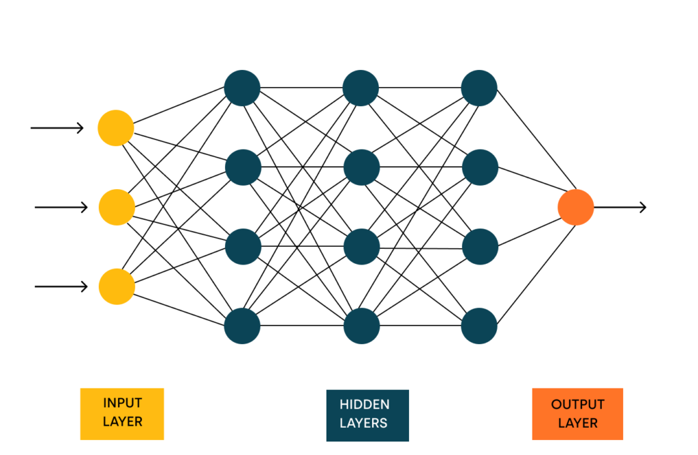

- Deep learning mimics the human brain and aims to enable machines to learn from their environment, similar to human learning processes.
- The concept of deep learning emerged in the 1950s and 1960s, where researchers sought to create machines that could learn like humans.
### Neural Networks
- The simplest form of a neural network is the perceptron, which faced challenges in learning effectively due to limitations in its architecturs.
- In the 1980s, advancements were made with the introduction of backpropagation, a method that significantly improved the efficiency of neural networks.

### Learning Process
- The learning process in neural networks can be compared to how humans learn to distinguish between objects, such as dogs and cats, by recognizing specific features.
- Inputs are processed through various layers in the neural network, starting from the input layer, which receives sensory information.
### Neural Network Architecture
- The architecture of a neural network consists of multiple layers where information is passed through neurons, allowing the network to learn and make predictions.
- The role of activation functions in determining the output of neurons will be discussed in future videos.