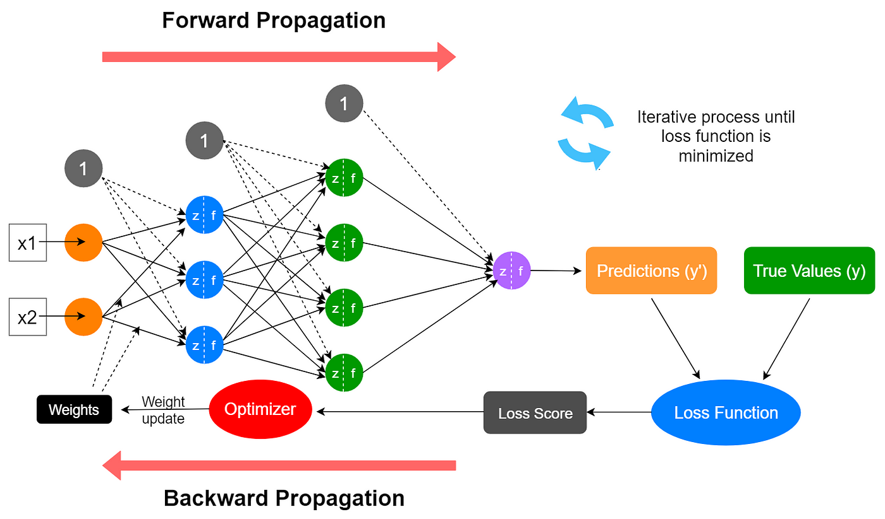

### Overview of Neural Networks
- The tutorial focuses on explaining how neural networks function, building on the previously discussed architecture of a basic neural network.
- The session is divided into multiple parts, covering forward propagation, activation functions, and backward propagation.
### Forward Propagation
- Forward propagation involves the processing of input features through neurons, where each feature is associated with weights (e.g. w1, w2, w3).
- The first step in forward propagation is the summation of weighted inputs, represented mathematically as 
Y = w1⋅x1 + w2⋅x2 + w3⋅x3.
- A bias term is added to the summation before applying an activation function, which helps in adjusting the output.
### Activation Functions
- An activation function determines whether a neuron should be activated based on the weighted sum and bias, transforming outputs between 0 and 1.
- If the output of the activation function is greater than 0.5, the neuron activates; otherwise, it does not.
### Importance of Weights and Bias
- The weights assigned to inputs play a crucial role in determining the activation of neurons, similar to how the human nervous system operates.
- The tutorial emphasizes that the process of activation and weight adjustment occurs in every neuron, affecting the overall output of the neural network.
### Backward Propagation
- After forward propagation, the output is passed to the output layer, where weights are again applied, and an activation function is used to determine the final output.

